# Theme Preview

Here are all cards with themes.
| :bell: | If only show Top Languages card here, then you maybe forgot to use [Personal access token](https://docs.github.com/en/actions/configuring-and-managing-workflows/creating-and-storing-encrypted-secrets) instead of GITHUB_TOKEN in workflow. |
| :-------: | :------------------------------------------------------------------------------------------------------------------------------------------------------------------------------------------------------------------------------------------------ |

## [2077](./2077/README.md)
[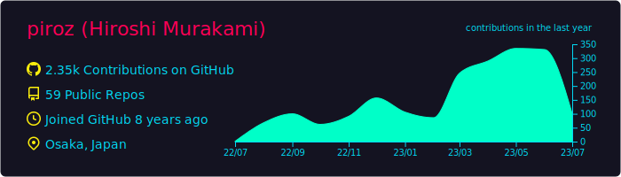](https://github.com/vn7n24fzkq/github-profile-summary-cards)
 [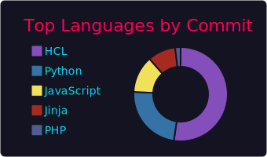](https://github.com/vn7n24fzkq/github-profile-summary-cards)
 
## [algolia](./algolia/README.md)
[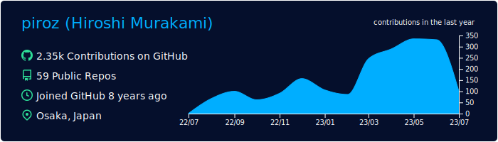](https://github.com/vn7n24fzkq/github-profile-summary-cards)
[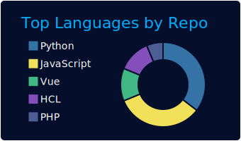](https://github.com/vn7n24fzkq/github-profile-summary-cards) 
 
## [apprentice](./apprentice/README.md)
[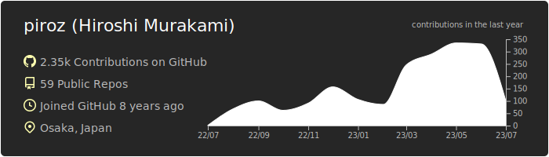](https://github.com/vn7n24fzkq/github-profile-summary-cards)
[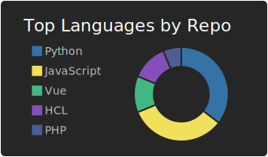](https://github.com/vn7n24fzkq/github-profile-summary-cards) 
 [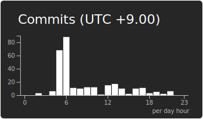](https://github.com/vn7n24fzkq/github-profile-summary-cards)
## [aura_dark](./aura_dark/README.md)
[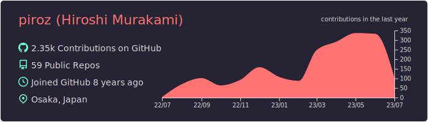](https://github.com/vn7n24fzkq/github-profile-summary-cards)
 [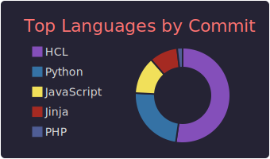](https://github.com/vn7n24fzkq/github-profile-summary-cards)
[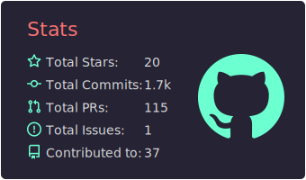](https://github.com/vn7n24fzkq/github-profile-summary-cards) 
## [aura](./aura/README.md)
[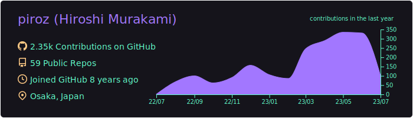](https://github.com/vn7n24fzkq/github-profile-summary-cards)
[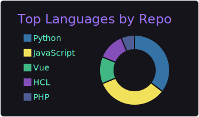](https://github.com/vn7n24fzkq/github-profile-summary-cards) 
[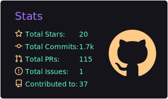](https://github.com/vn7n24fzkq/github-profile-summary-cards) [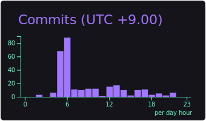](https://github.com/vn7n24fzkq/github-profile-summary-cards)
## [ayu_mirage](./ayu_mirage/README.md)
[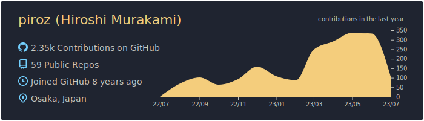](https://github.com/vn7n24fzkq/github-profile-summary-cards)
 
 
## [bear](./bear/README.md)

 
 
## [blue_green](./blue_green/README.md)
[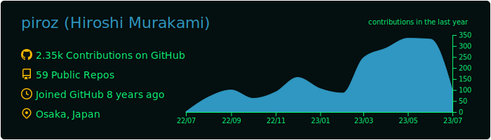](https://github.com/vn7n24fzkq/github-profile-summary-cards)
[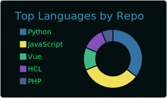](https://github.com/vn7n24fzkq/github-profile-summary-cards) [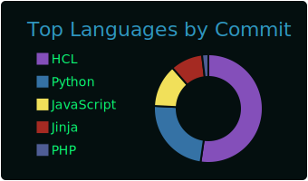](https://github.com/vn7n24fzkq/github-profile-summary-cards)
 [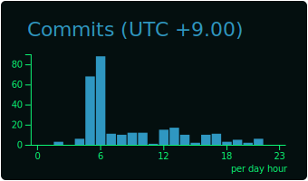](https://github.com/vn7n24fzkq/github-profile-summary-cards)
## [blueberry](./blueberry/README.md)
[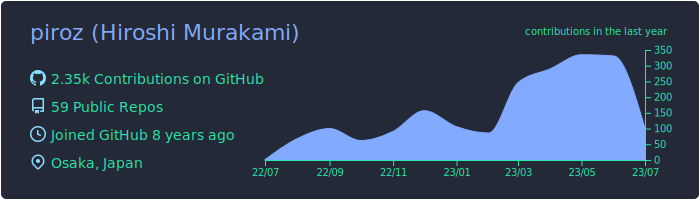](https://github.com/vn7n24fzkq/github-profile-summary-cards)
[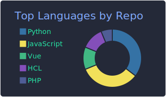](https://github.com/vn7n24fzkq/github-profile-summary-cards) [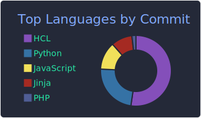](https://github.com/vn7n24fzkq/github-profile-summary-cards)
 
## [buefy](./buefy/README.md)
[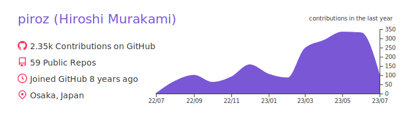](https://github.com/vn7n24fzkq/github-profile-summary-cards)
[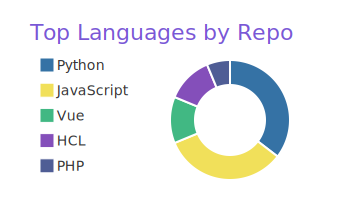](https://github.com/vn7n24fzkq/github-profile-summary-cards) [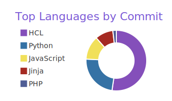](https://github.com/vn7n24fzkq/github-profile-summary-cards)
[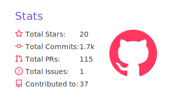](https://github.com/vn7n24fzkq/github-profile-summary-cards) [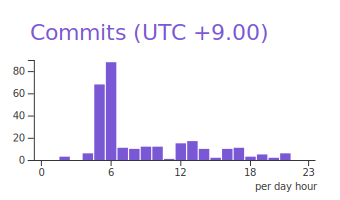](https://github.com/vn7n24fzkq/github-profile-summary-cards)
## [calm](./calm/README.md)

 [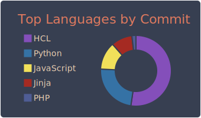](https://github.com/vn7n24fzkq/github-profile-summary-cards)
[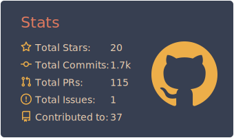](https://github.com/vn7n24fzkq/github-profile-summary-cards) 
## [chartreuse_dark](./chartreuse_dark/README.md)
[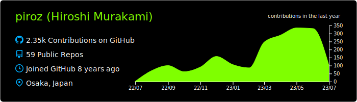](https://github.com/vn7n24fzkq/github-profile-summary-cards)
 [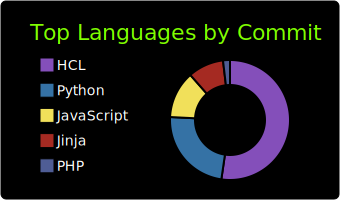](https://github.com/vn7n24fzkq/github-profile-summary-cards)
 [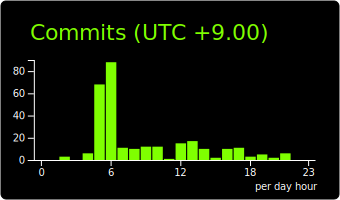](https://github.com/vn7n24fzkq/github-profile-summary-cards)
## [city_lights](./city_lights/README.md)

[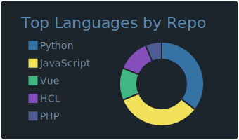](https://github.com/vn7n24fzkq/github-profile-summary-cards) [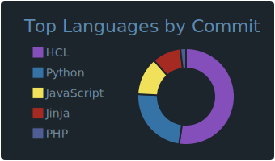](https://github.com/vn7n24fzkq/github-profile-summary-cards)
 
## [cobalt](./cobalt/README.md)
[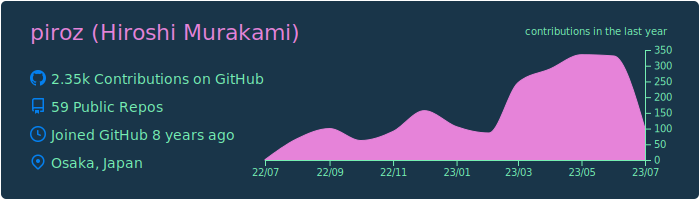](https://github.com/vn7n24fzkq/github-profile-summary-cards)
[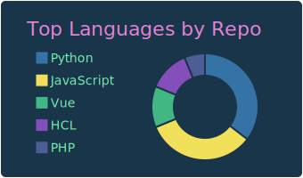](https://github.com/vn7n24fzkq/github-profile-summary-cards) [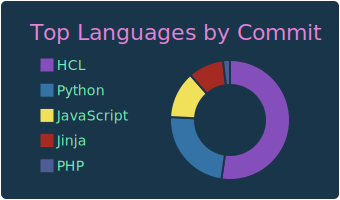](https://github.com/vn7n24fzkq/github-profile-summary-cards)
 [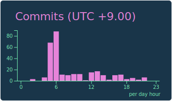](https://github.com/vn7n24fzkq/github-profile-summary-cards)
## [cobalt2](./cobalt2/README.md)

 [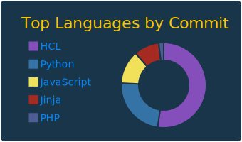](https://github.com/vn7n24fzkq/github-profile-summary-cards)
[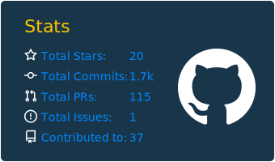](https://github.com/vn7n24fzkq/github-profile-summary-cards) [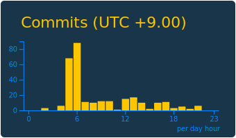](https://github.com/vn7n24fzkq/github-profile-summary-cards)
## [codeSTACKr](./codeSTACKr/README.md)

 [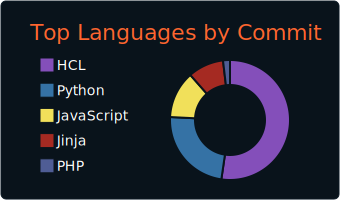](https://github.com/vn7n24fzkq/github-profile-summary-cards)
[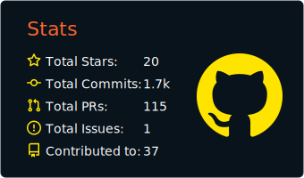](https://github.com/vn7n24fzkq/github-profile-summary-cards) 
## [darcula](./darcula/README.md)

 [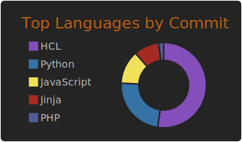](https://github.com/vn7n24fzkq/github-profile-summary-cards)
[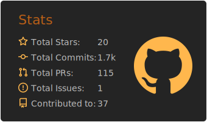](https://github.com/vn7n24fzkq/github-profile-summary-cards) 
## [dark](./dark/README.md)
[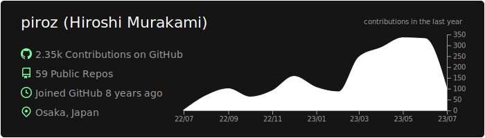](https://github.com/vn7n24fzkq/github-profile-summary-cards)
[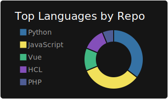](https://github.com/vn7n24fzkq/github-profile-summary-cards) [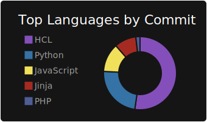](https://github.com/vn7n24fzkq/github-profile-summary-cards)
[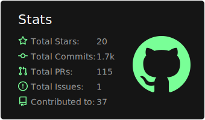](https://github.com/vn7n24fzkq/github-profile-summary-cards) [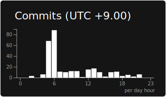](https://github.com/vn7n24fzkq/github-profile-summary-cards)
## [date_night](./date_night/README.md)

 
 
## [default](./default/README.md)

 
 
## [discord_old_blurple](./discord_old_blurple/README.md)

 
 
## [dracula](./dracula/README.md)

 
 
## [flag_india](./flag_india/README.md)

 
 
## [github_dark](./github_dark/README.md)

 
 
## [github](./github/README.md)

 
 
## [gotham](./gotham/README.md)

 
 
## [graywhite](./graywhite/README.md)

 
 
## [great_gatsby](./great_gatsby/README.md)

 
 
## [gruvbox](./gruvbox/README.md)

 
 
## [highcontrast](./highcontrast/README.md)

 
 
## [jolly](./jolly/README.md)

 
 
## [kacho_ga](./kacho_ga/README.md)

 
 
## [maroongold](./maroongold/README.md)

 
 
## [material_palenight](./material_palenight/README.md)

 
 
## [merko](./merko/README.md)

 
 
## [midnight_purple](./midnight_purple/README.md)

 
 
## [moltack](./moltack/README.md)

 
 
## [monokai](./monokai/README.md)

 
 
## [moonlight](./moonlight/README.md)

 
 
## [nightowl](./nightowl/README.md)

 
 
## [noctis_minimus](./noctis_minimus/README.md)

 
 
## [nord_bright](./nord_bright/README.md)

 
 
## [nord_dark](./nord_dark/README.md)

 
 
## [ocean_dark](./ocean_dark/README.md)

 
 
## [omni](./omni/README.md)

 
 
## [onedark](./onedark/README.md)

 
 
## [outrun](./outrun/README.md)

 
 
## [panda](./panda/README.md)

 
 
## [prussian](./prussian/README.md)

 
 
## [radical](./radical/README.md)

 
 
## [react](./react/README.md)

 
 
## [rose_pine](./rose_pine/README.md)

 
 
## [shades_of_purple](./shades_of_purple/README.md)

 
 
## [slateorange](./slateorange/README.md)

 
 
## [solarized_dark](./solarized_dark/README.md)

 
 
## [solarized](./solarized/README.md)

 
 
## [swift](./swift/README.md)

 
 
## [synthwave](./synthwave/README.md)

 
 
## [tokyonight](./tokyonight/README.md)

 
 
## [transparent](./transparent/README.md)

 
 
## [vision_friendly_dark](./vision_friendly_dark/README.md)

 
 
## [vue](./vue/README.md)

 
 
## [yeblu](./yeblu/README.md)

 
 
## [zenburn](./zenburn/README.md)

 
 
